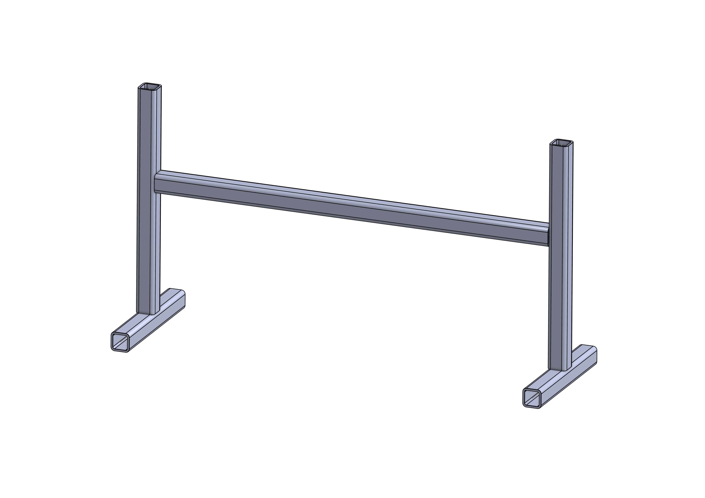

# Incongruency Hardware

List of hardware necessary for building the setup for incongruency.

## Frame

- Aluminum profile (any brand): x5

    - 100mm x1

    - 60mm x2

    - 43mm x2 (+ or -, for the feet)

- Right angle brackets: x6

    - Screws: x12

    - Bolts: x12

- Swivel joint 180°: x3

    - Screws: x6

    - Bolts: x6

- (Optional) End caps: x6

## Screen

The screen is fixed via 2 swivel joints and the appropriate screws for the screen, above the central profile.

## Camera

The screen is fixed via a swivel joint and a camera screw below the central profile.

## Computer

Running the current algorithm requires quite a bit of computing power. It has been tested to run correctly on an Nvidia RTX 4060.
